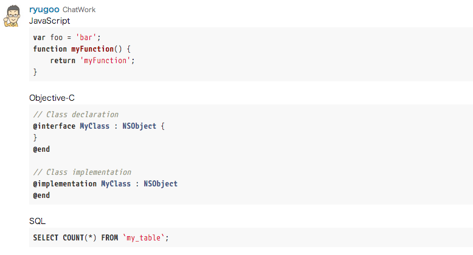

# ChatWork Code Syntax Highlighter

This is Chrome extension that provide program code syntax highlight and disable emotions for [ChatWork](http://www.chatwork.com/).  
(Code base is [chatwork.md](https://github.com/tan-yuki/chatwork.md))

**This module is "UNOFFICIAL" product and no support. Do not inquiry to ChatWork.**

## Feature

* Program code Syntax highlight
* Disable emoticons

## Usage

### Enable syntax highlight

```
[cw:code lang="js"]
var foo = 'bar';
function myFunction() {
    return 'myFunction';
}
[/cw:code]
```

or

<pre><code>```js
var foo = 'bar';
function myFunction() {
    return 'myFunction';
}
```</code></pre>

### Only disable emoticons

```
[cw:code lang="no-highlight"]
:):(:D8-):o;);(
[/cw:code]
```

or

<pre><code>```
:):(:D8-):o;);(
```</code></pre>

Please see ["highlight.js" document](http://highlightjs.readthedocs.org/en/latest/css-classes-reference.html) how enable language names.

## Sample



## License

This extension released under the BSD License. See LICENSE file for details and [highlight.js](https://highlightjs.org/) license is [here](https://github.com/isagalaev/highlight.js/blob/master/LICENSE).
